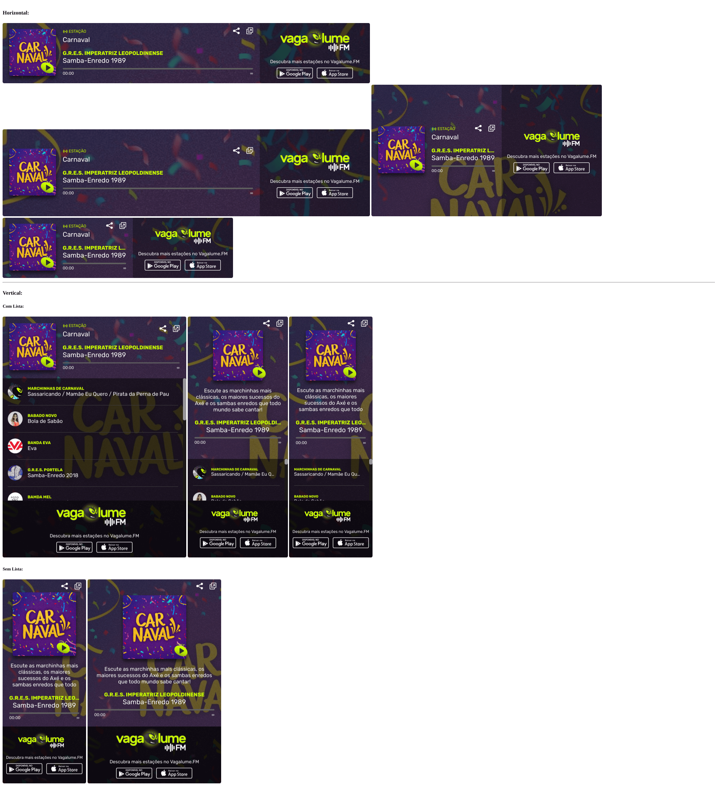

# Widget de estações do Vagalume.FM

O arquivo [index.html](index.html) é o exemplo do que deve ser incorporado na página do parceiro com iframe. Realize as modificações necessárias, de forma que a chamada do _init_ tenha o ID da estação (stationID) que pode ser obtido pela URL da imagem de destaque da estação.

Já a opção _target_ é a URL que será aberta no _window.open()_ caso a pessoa clique para abrir em uma janela separada, podendo abrir diretamente o [index.html](index.html) ou uma página com um `iframe` (no caso de adicionar header, footer ou outro elemento do parceiro), exemplo disponível no arquivo [exemplo_com_header.html](exemplos/exemplo_com_header.html). O ideal é que o conteúdo deste widget seja armazenado em um subdiretório (ou subdomínio) de forma que os assets (img, js e css) estejam corretamente organizados.  

```javascript
fmWidget.init({
    stationID: '1487264817696485', // https://vagalume.fm/carnaval/
    target: 'https://siteparceiro.com/vagalumefm/index.html'
});
```

# Dimensões

## Horizontal

Largura Mínima: 690px  
Largura Máxima: Não definido    
Altura Mínima: 180px  
Altura Máxima: 394px  

## Vertical

Largura Mínima: 250px  
Largura Máxima: Não definido  
Altura Mínima: 640px  
Altura Máxima: Não definido

### Vertical (Info quebrada)

Largura Mínima: 250px  
Largura Máxima: 400px  
Altura Mínima (Com lista de Música): 670px   
Altura Mínima (Sem lista): 640px

# Screenshots



# Github Mirror

Este repositório é espelhado no Github
https://github.com/vagalume/fm-widget/
